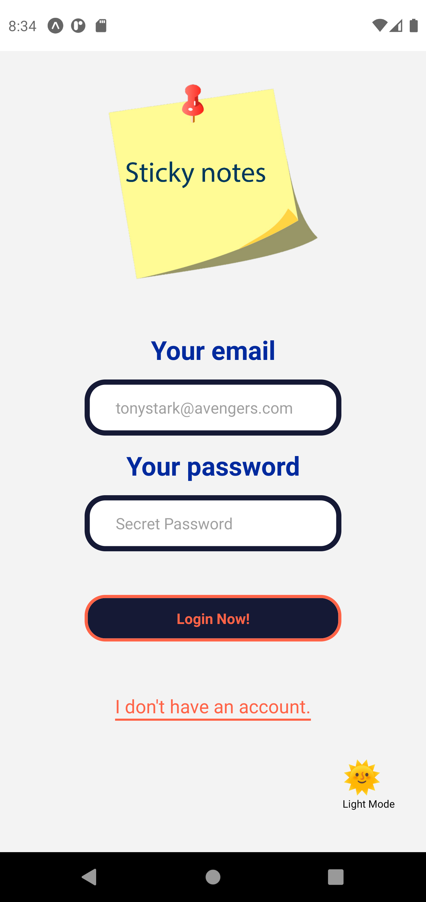
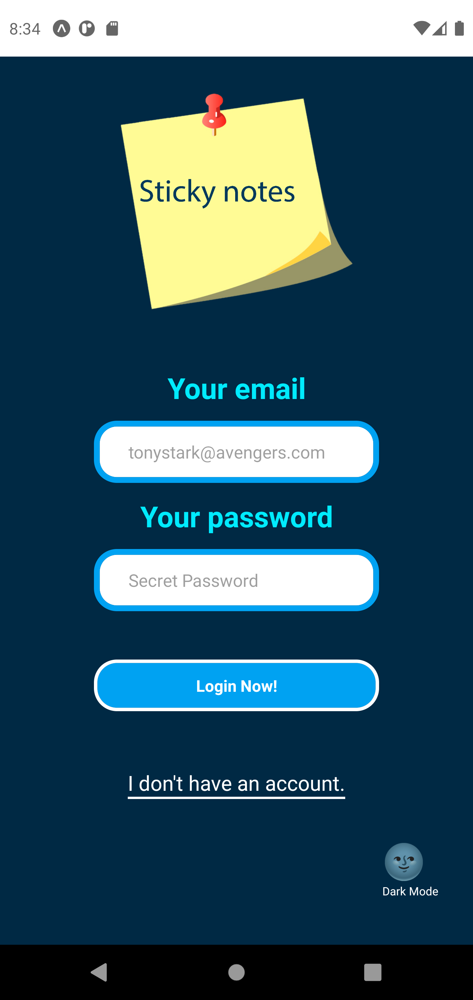
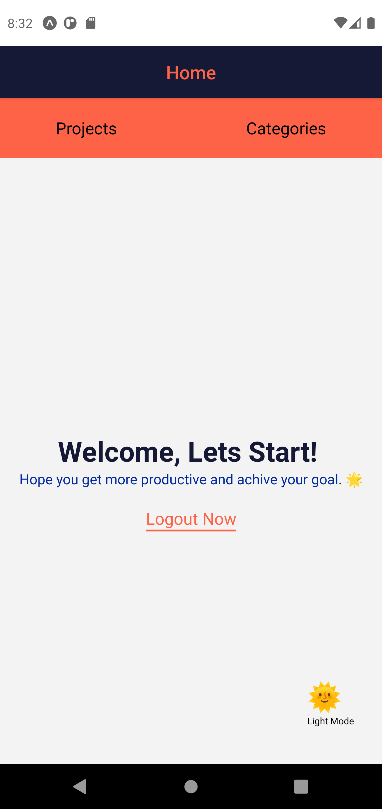
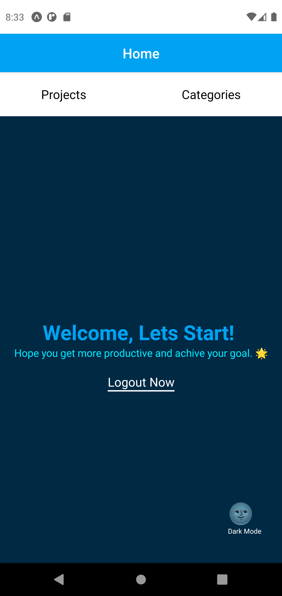
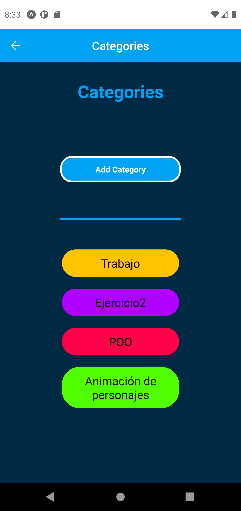
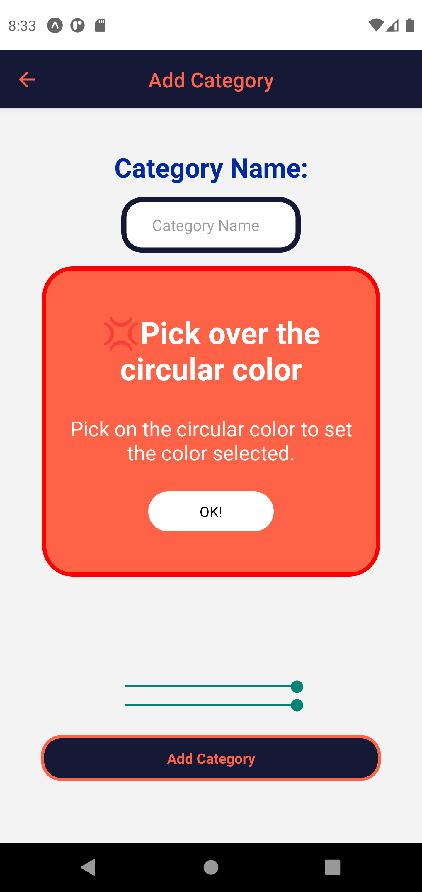
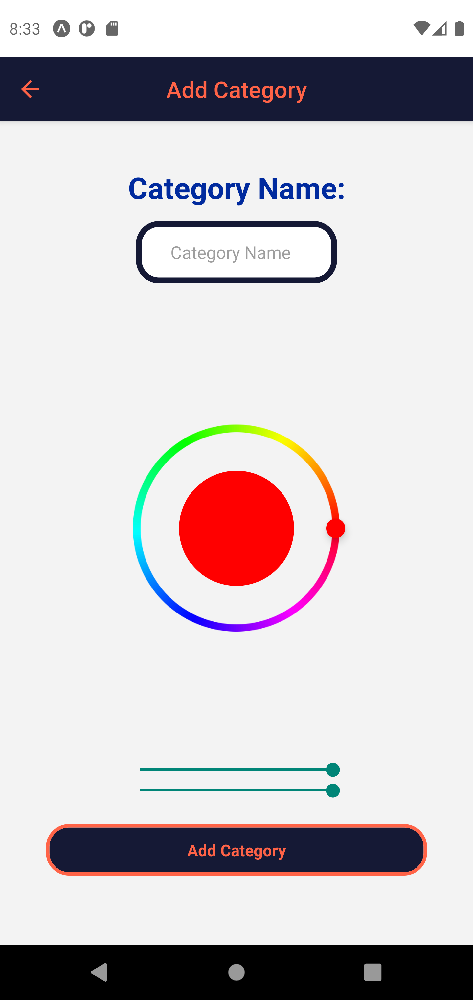
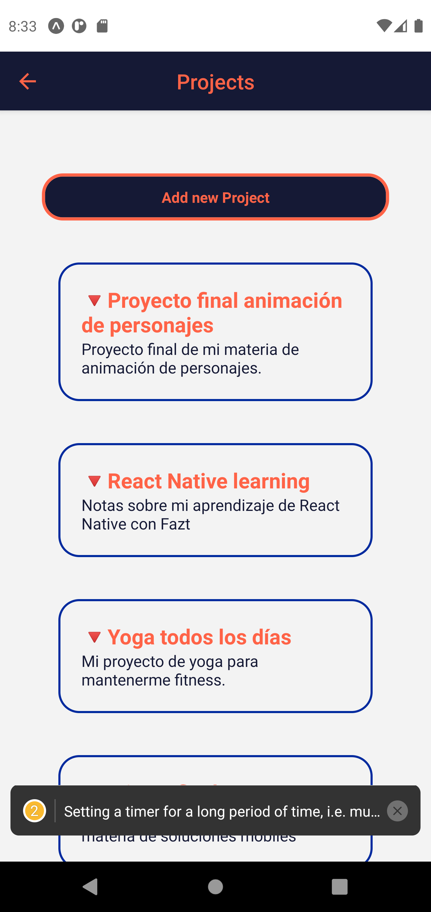
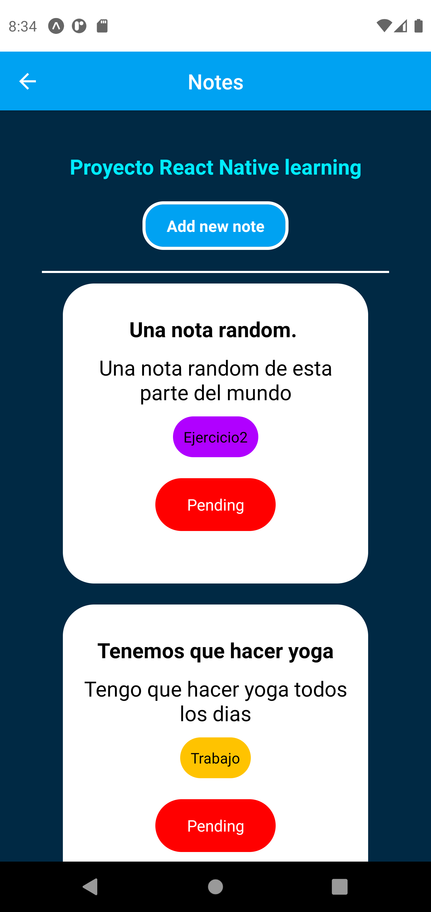

# Sticky Notes and Projects.

## The app for adding projects notes and categories.

#### Made with ❤

[Test and download the app for android](tricky-ground.surge.sh)

Set up steps

```shell

git clone https://github.com/soyalextreme/sticky-projects.git #clone the repo

cd sticky-projects # change directory

npm install # install dependencies

npm install -G expo-cli # install expo cli

npm run start # run develper mode


```

## Preview for the app










